# Contrastive Prior Enhances the Performance of Bayesian Neural Network-based Molecular Property Prediction (CPBayesMPP)

This repository is an implementation of our paper "Contrastive Prior Enhances the Performance of Bayesian Neural
Network-based Molecular Property Prediction" in PyTorch. In this work, we propose a method called **<u>CPBayesMPP</u>**,
aiming at enhancing (1) prediction accuracy and (2) uncertainty quantification capacity (UQ) performance of Bayesian
Neural Network (BNN).

The overview of CPBayesMPP is shown as following:

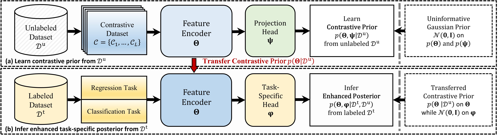

CPBayesMPP contains two main stages:

- **Stage (a): Learn contrastive prior from unlabeled dataset.** Instead of traditionally specifying an uninformative
  prior (e.g., isotropic Gaussian) on the parameters, we try to learn an informative contrastive prior from the
  large-scale unlabeled dataset, which can more precisely describe the molecular structural space.
- **Stage (b): Infer enhanced task-specific posterior from labeled dataset.** Here, incorporating the learned
  contrastive prior, we infer a prior-enhanced task-specific posterior for the parameters, which can improve the
  prediction accuracy and UQ performance for the downstream datasets.

The details of CPBayesMPP are described in our paper.

## Table of contents

- [Requirements](#requirements)
- [Datasets](#datasets)
- [Checkpoints](#checkpoints)
- [Stage (a): Pre-training to learn contrastive prior](#stage-a-pre-training-to-learn-contrastive-prior)
- [Stage (b): Infer enhanced task-specific posterior](#stage-b-infer-enhanced-task-specific-posterior)
- [Stage (c): Enhanced-posterior prediction case studies](#stage-c-enhanced-posterior-prediction-case-studies)
    - [Case study 1. Prediction accuracy Improvement](#case-study-1-prediction-accuracy-improvement)
    - [Case study 2. In-distribution Uncertainty quantification performance improvement](#case-study-2-in-distribution-uncertainty-quantification-performance-improvement)
    - [Case study 3. Out-of-distribution (OOD) detection performance improvement](#case-study-3-out-of-distribution-ood-detection-performance-improvement)
    - [Case study 4. Active learning performance improvement](#case-study-4-active-learning-performance-improvement)
    - [Case study 5. Prior Prediction performance of contrastive prior](#case-study-5-prior-prediction-performance-of-contrastive-prior)
    - [Case study 6. Uncertainty quantification deficiency on classification dataset](#case-study-6-uncertainty-quantification-deficiency-on-classification-dataset)
- [Enhance the task-specific posterior on customized dataset](#enhance-the-task-specific-posterior-on-customized-dataset)
- [Thanks](#thanks)
- [Cite us](#cite-us)

## Requirements
You can refer to the `requirements.txt` file to download all the necessary dependencies.

The main library versions are as follows:

- torch == 1.10.0+cu113
- numpy == 1.24.4
- scikit-learn == 1.3.2
- rdkit == 2022.9.5

## Datasets

- **Pre-training dataset:** We randomly extract 1 million unlabeled molecules
  from <u>[ChemBERTa](https://arxiv.org/abs/2010.09885)</u> to form the contrastive pre-training dataset and save them
  in the `pubchem-1m-clean.csv` file. You can download
  it <u>[here](https://drive.google.com/file/d/1FO_otxK3WHA629Xu1oseDWJPPJCUbgu5/view?usp=sharing)</u> and place it in
  the `/dataset` folder.
- **Downstream dataset:** we conduct experiments on 6 regression and 6 classification downstream datasets, including:
    - **Regression benchmarks:** ESOL (named as Delaney), FreeSolv, Lipo, QM7, QM8 and PDBbind.
    - **Classification benchmarks:** BACE, Tox21, HIV, BBBP, SIDER and ClinTox.
    - All these datasets have been saved in the `/dataset` folder under the corresponding names. You can also find the
      original ones from <u>[MoleculeNet](https://moleculenet.org/datasets-1)</u>.

## Checkpoints
- **⭐ Note: Before performing each of the following experiments, please carefully check the corresponding hyperparameter settings provided in the checkpoint's `logger.log` file.**
- Please download the checkpoints <u>[here](https://drive.google.com/file/d/15jMYuJ7SWyPOmjowscq0LWgZECexvmge/view?usp=sharing)</u>, and place in the project as directory `/results`.
- All the (pretrain / downstream) results reported in the paper are derived from the provided checkpoints, which can be reproduced by the scripts in Stage (a), Stage (b) and Stage (c).


## Stage (a): Pre-training to learn contrastive prior

Run the script **[0-pretrain.py](0-pretrain.py)** by the following command for contrastive prior learning. (For the
detailed description, please refer to Section **"Learn contrastive prior from unlabeled dataset"** in the paper)

```bash 
python 0-pretrain.py --batch_size 512 --epochs 50 --save_dir results/pretrain --pretrain_data_name pubchem-1m-clean 
```

The pre-training MPNN encoder will be saved as `/results/pretrain/pretrain_encoder.pt`, while the transformation header
will be saved as `/results/pretrain/pretrain_header.pt`.

**Note: How to accelerate pre-training?**

We recommend using a _cache mechanism_ to speed up the pre-training process as follows, because we have found in
practice that the main overhead of the pretraining process comes from the augmentation operations on contrastive
samples.

* Step 1: Run the script [prepare_pretrain_cache.py](dataset/prepare_pretrain_cache.py) to generate and save the
  augmented sample pairs in advance. This will save the batch augmented samples, with the
  name `smiles_to_contra_graph_batch_0.pkl`, to the `/pubchem-1m-clean-cache` folder. You can download the preprocessed
  cache file [here](https://drive.google.com/file/d/1w6fz1X1IF00UigEjmzh6UbTOvrqKhtPk/view?usp=sharing) and extract it
  to the /dataset folder.

* Step 2: Run the following command to use cache for accelerating the pretraining process (on an 11GB NVIDIA GeForce
  2080Ti GPU, each epoch takes ~ 30 minutes).

```bash
python 0-pretrain.py --batch_size 512 --epochs 50 --save_dir results/pretrain --pretrain_data_name pubchem-1m-clean --use_pretrain_data_cache True
```

## Stage (b): Infer enhanced task-specific posterior

**CPBayesMPP:** In downstream tasks, you can use the following commands to infer the enhanced task-specific posterior (
Remember to move the pre-trained folder `results/pretrain` into the folder `results/cl/pretrain`).

```bash
python 1-train.py --data_name delaney --train_strategy CPBayesMPP --epoch 200 --split_type random --split_sizes 0.5 0.2 0.3
```

This will output the trained model to the `results/CPBayesMPP/random_split/delaney_checkpoints` folder. The prediction on the test set can be found in the file `seed_i/preds.csv`, and the variational parameters can be found in the file `seed_i/model`, for each random seed i.

**BayesMPP:** For comparison, you can run the following command, which will train the model using an uninformative
prior.

```bash
python 1-train.py --data_name delaney --train_strategy BayesMPP --epoch 200 --split_type random --split_sizes 0.5 0.2 0.3
```

**Notes:**

- The `--train_strategy` parameter can be set to `CPBayesMPP` or `BayesMPP` for training, respectively. `CPBayesMPP`
  means contrastive learning with contrastive prior, and `BayesMPP` means concrete dropout with uninformative prior.
- In regression tasks, we use `random split` with a `50/20/30` ratio, while in classification tasks, we
  use `scaffold split` with a `80/10/10` ratio.
- To reproduce the results on other datasets, please change the `--data_name` parameter. For larger datasets (QM8, HIV), the parameter `--epoch` is set to 50, while for all other datasets, it is set to 200.
- Additional hyperparameters for each dataset can be found in the `logger.log` of the corresponding checkpoints. For example, `/results/CPBayesMPP/random_split/freesolv_checkpoints/logger.log`.
- See more details in the Section "**Model Training Detail**" in the paper.

## Stage (c): Enhanced-posterior prediction case studies

**You can reproduce all experimental results in our paper through the following case studies.**

<hr style="border: 0.1px">

### Case study 1. Prediction accuracy Improvement

The training logs for different training strategies have been saved to the corresponding folders during the training
process. For example, the training logs of the Delaney dataset under the CPBayesMPP strategy can be found
in `result/CPBayesMPP/random_split/delaney_checkpoints/logger.log`. The average performance (RMSE/AUC-ROC for regression/classification datasets, respectively) across 8 random seeds for
this dataset can be found at the end of the log:

```text
delaney_checkpoints/logger.log
...
Epoch 198: Train Loss = -4.7935, Validation rmse =  0.7150
Epoch 199: Train Loss = -4.8344, Validation rmse =  0.7278
Seed 890 test rmse = 0.700586
Overall test rmse = 0.720874 +/- 0.021191
```

Note that different hyperparameter settings or environments may affect predictive performance, as discussed in
Supplementary Information Section 5.2.

**⭐ Therefore, to ensure a fair comparison, we keep the hyperparameter settings
consistent for both BayesMPP and CPBayesMPP across all datasets.** 

In most experimental settings, CPBayesMPP (with informative prior) should outperform BayesMPP (with non-informative prior)
in predictive performance (RMSE/AUC-ROC)

(Please refer to the `logger.log` file for the
hyperparameter settings.)

```text
delaney_checkpoints/logger.log
{
 ...
 'depth': 3,
 'epochs': 200,
 'ffn_hidden_size': 300,
 'ffn_num_layers': 2,
 'final_lr': 0.0001,
 'hidden_size': 300,
 'init_lr': 0.0001,
 'kl_weight': 1.0,
 'max_lr': 0.001,
 ...
}
```

We believe that the prediction errors should remain within the standard deviation (±) shown in Tables 1 and 2.

**Notes:** See more details in the Section "**Predictive performance improvement**" in the paper.

<details>
  <summary><b>Click here for the results!</b></summary>

<b>Performance comparison (RMSE, the lower the better) of different methods on 6 regression datasets</b>

|  |
|-------------------------------------------------------------|

<b>Performance comparison (AUC-ROC, the higher the better) of different methods on 6 classification datasets</b>

|  |
|--------------------------------------------------------------------|

</details>

<hr style="border: 0.1px">

### Case study 2. In-distribution Uncertainty quantification performance improvement

**Please note that, before starting the UQ experiments, ensure you have re-run Stage (b) to obtain `checkpoints` for all
datasets, or have downloaded the provided one and placed them in the specified path.**

⭐ Here, `Random` split is used to divide the regression datasets into train/val/test sets to ensure chemical space overlap among subsets. Thus, the test set can be considered as _In-distribution_ data.

**Step (1):** Check the uncertainty prediction
files (`results/CPBayesMPP/random_split/delaney_checkpoints/seed_123/preds.csv`) for each dataset, which contain all the
data required for the uncertainty quantification (UQ) experiments, including:

- `pred`: The output prediction of the model.
- `label`: True label.
- `alea_unc`: The Aleatoric uncertainty.
- `epis_unc`: The Epistemic uncertainty.

**Step (2):** Plot the uncertainty calibration curves (Points) for regression datasets.

- **① Ranking-based method and auco:** One method to measure uncertainty quantification (UQ) capability is to evaluate
  how the error of samples varies with changes in uncertainty. We sort all test set samples by their uncertainties (as
  defined in Eqn. (18)) from high to low. We then iteratively remove the samples with highest uncertainties and
  calculate the uncertainty of the remaining ones.
  ```bash
  python 2-visualize_uq.py --visualize_type auco --data_name delaney --split_type random --uncertainty_type aleatoric 
  ```

- **② Confidence-based method and AUCE:** One limitation of the ranking-based method is that it ignores the actual value
  of uncertainty. For example, when the error of a sample is 0.5, we expect its uncertainty to also be 0.5. Therefore,
  Confidence based method is used to measure the consistency between uncertainty and error. Specifically, for a sample
  𝐱, Confidence based calibration interprets its prediction and uncertainty as the mean and the variance of a Gaussian
  distribution.
  ```bash
  python 2-visualize_uq.py --visualize_type auce --data_name delaney --split_type random --uncertainty_type aleatoric 
  ```

- **③ Error-based method and ENCE:** Unlike Confidence-based calibration that consider confidence intervals, Error-based
  calibration directly compares uncertainty with prediction error.
  ```bash
  python 2-visualize_uq.py --visualize_type ence --data_name delaney --split_type random --uncertainty_type aleatoric 
  ```

- **④ Coefficient of variation C_v:** The Coefficient of Variation C_v is used to measure the uncertainty dispersion.
  ```bash
  python 2-visualize_uq.py --visualize_type Cv --data_name delaney --split_type random --uncertainty_type aleatoric 
  ```

- The results will be saved in the folder `/figures/Uncertainty_calibration_curves_for_regression_datasets`.

**Notes:**

* Specify `--uncertainty_type` as `aleatoric`, `epistemic` or `total` to visualize the different uncertainty calibration
  curves.
* Regression uncertainty curves will be saved in the
  folder `/figures/Uncertainty calibration curves for regression datasets`.
* See more details in the Section "**Uncertainty quantification performance improvement**" in the paper.

<details>
    <summary><b>Click here for the results!</b></summary>

<b>In-distribution Uncertainty Calibration Curves for ELSO dataset.</b>

| 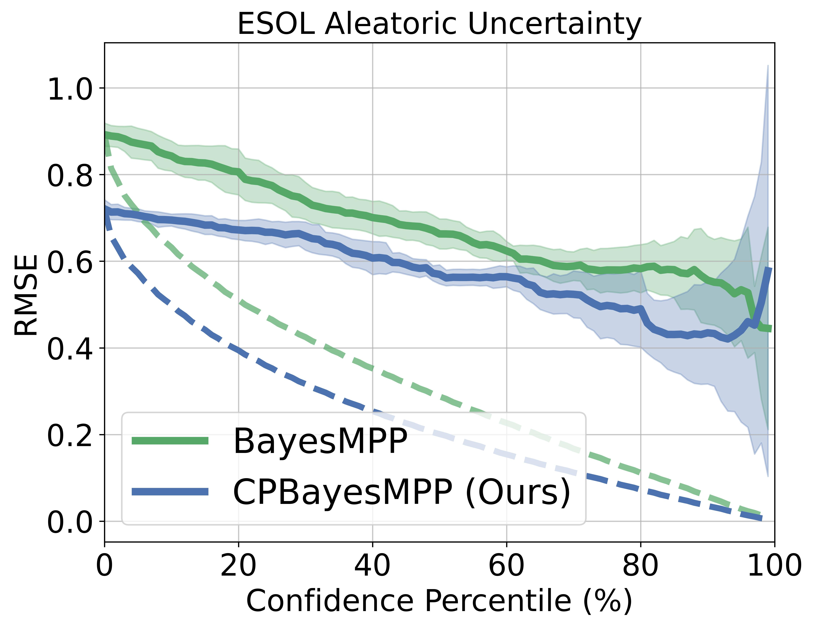 | 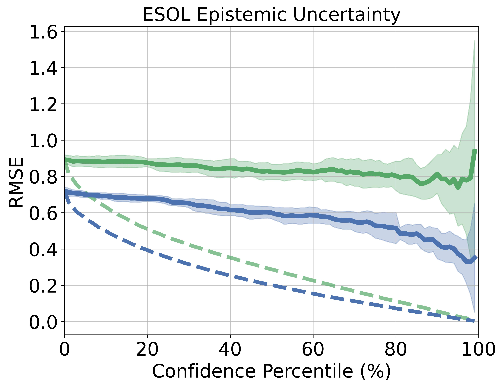 | 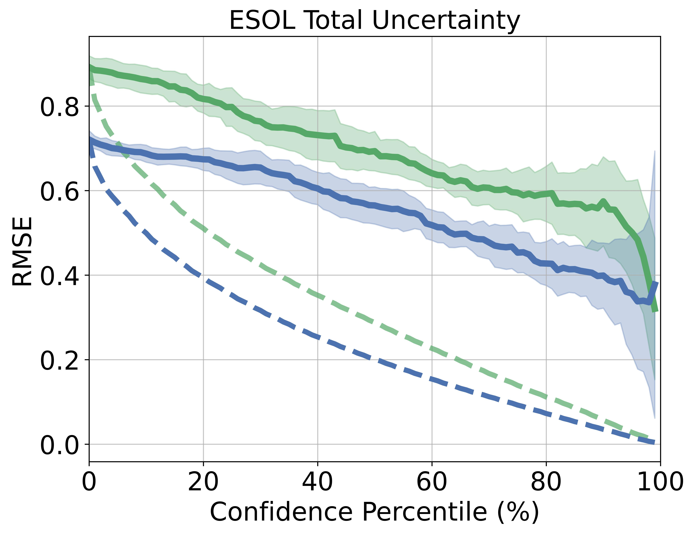 |
|--------------------------------------------------------------------------------|-------------------------------------------------------------------------------------------------------------|---------------------------------------------------------------------------------------------------------|

<b>In-distribution AUCO Performance improvement on regression datasets.</b>

|  |
|--------------------------------------------------------------|

</details>

<hr style="border: 0.1px">

### Case study 3. Out-of-distribution (OOD) detection performance improvement

⭐ Here, we used `scaffold` split to divide the train/valid/test sets. This splitting method ensures that there is no scaffold overlap between different sets. As a result, the molecules in the test set are considered as _Out-of-distribution_ (OOD) data relative  to those in the training set.

Then, Ranking-based method and AUCO are used to measure the OOD detection performance.

**Step (1):** Train the model using CPBayesMPP and BayesMPP strategies.

```bash
python 3-1-ood_train.py --data_name delaney --train_strategy BayesMPP+OOD --epoch 200 --split_type scaffold --split_sizes 0.5 0.2 0.3 --kl_weight 10
```

```bash
python 3-1-ood_train.py --data_name delaney --train_strategy CPBayesMPP+OOD --epoch 200 --split_type scaffold --split_sizes 0.5 0.2 0.3 --kl_weight 10
```

**Step (2):** Visualize the OOD detection performance.

```bash
python 3-2-visualize_ood_uq.py --data_name delaney --uncertainty_type aleatoric
```

**Notes:**
- In the OOD experiments, the KL divergence weight `λ` in Eqn. (16) of the manuscript is set to `λ = 10 * 10^-8 * |(D_tr)^t|^-1 * (1-p)` to avoid overfitting on the training set and enhance generalization performance.
- Similarly, both CPBayesMPP and BayesMPP employ the same experimental settings for fair comparison.
- See more details in the Section "**OOD detection performance improvement**" in the paper.

<details>
  <summary><b>Click here for the results!</b></summary>

<b>Out-of-distribution detection performance improvement.</b>

| 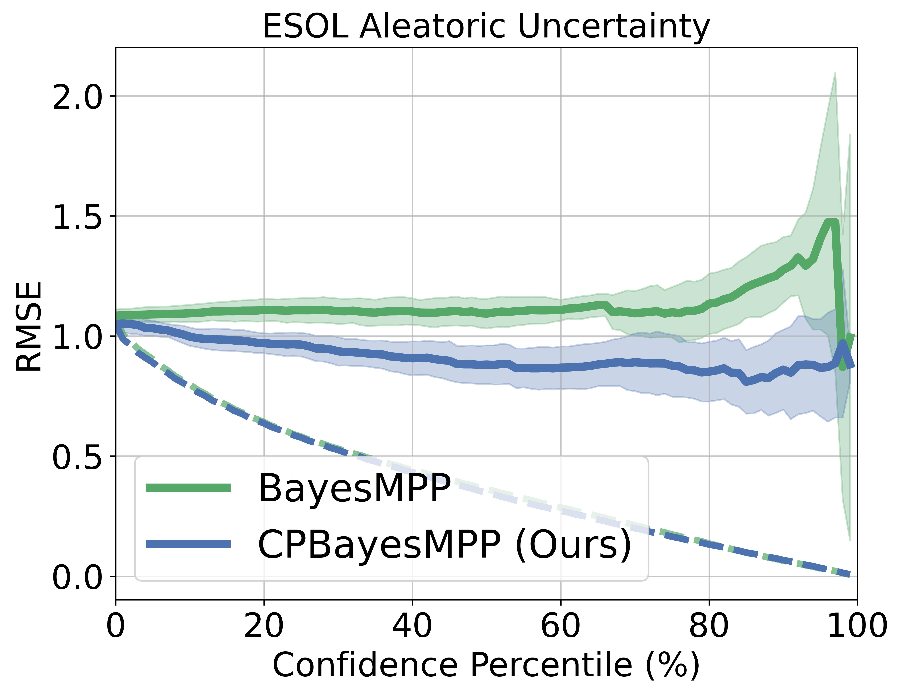 | 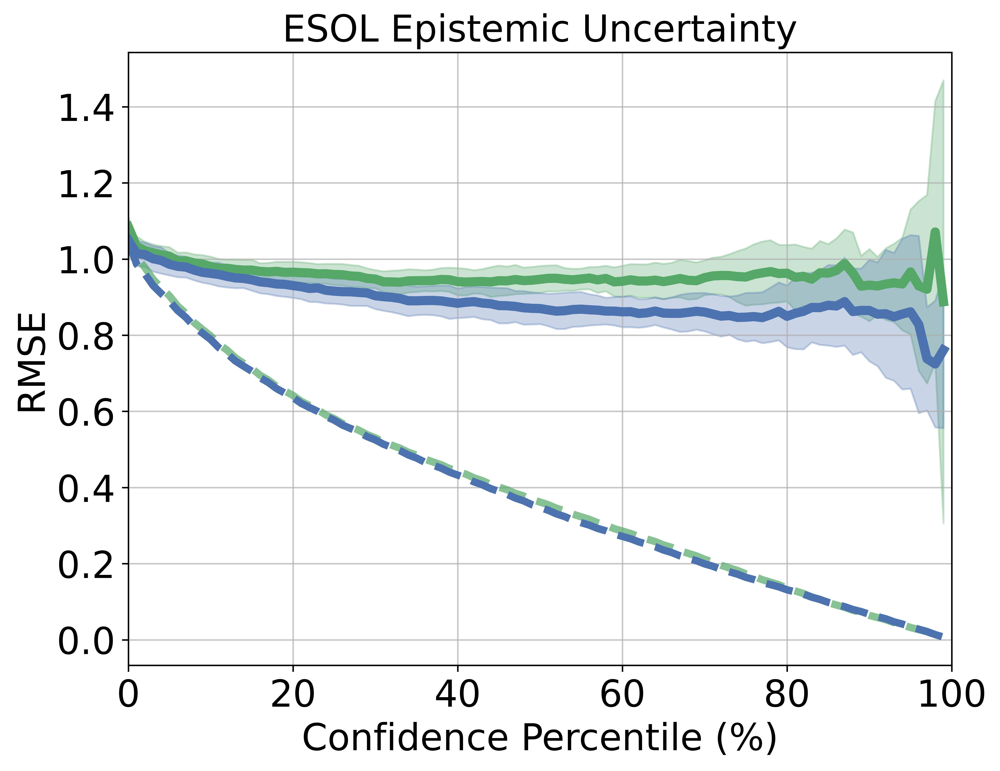 | 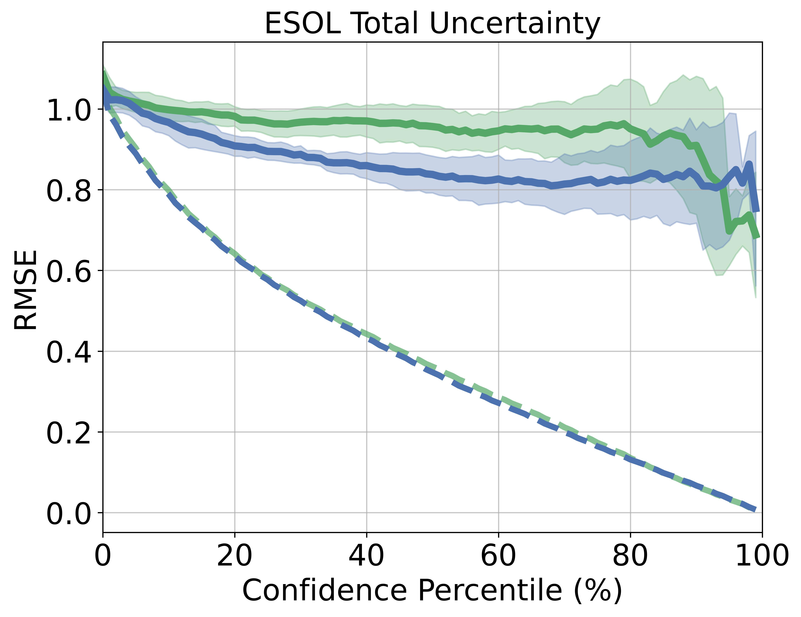 |
|----------------------------------------------------------|----------------------------------------------------------|----------------------------------------------------------|

<b>Out-of-distribution AUCO Performance improvement on regression datasets.</b>

|  |
|------------------------------------------------------------------|

</details>

<hr style="border: 0.1px">

### Case study 4. Active learning performance improvement

After validating the CPBayesMPP’s UQ capability improvement, we further investigated whether the contrastive prior could 
enhance the active learning performance of Bayesian neural network. 

**Step (1):** The model starts training with a small portion of the dataset, comprising 20% of the total training set.
Gradually, 5% of the remaining data is selected to expand the training pool, and the model is re-trained with this
expanded pool. Three selection strategies are used for comparison: **(1) "Random Selection":** 5% of the data is
randomly chosen with equal probability. **(2) "Explorative":** The top 5% of samples with the highest Epistemic
uncertainty is selected. **(3) "Oracle":** The top 5% of samples with the highest prediction error (in pratice
unavailable, output from CPBayesMPP) is chosen.

Now, train the model by 5 strategies:

- ① BayesMPP + Random Learning
  ```bash
  python 4-1-active_train.py --data_name qm8 --train_strategy BayesMPP+AL --al_type random --epoch 50 --split_type random  --split_sizes 0.5 0.2 0.3
  ```
- ② BayesMPP + Active Learning
  ```bash
  python 4-1-active_train.py --data_name qm8 --train_strategy BayesMPP+AL --al_type explorative --epoch 50 --split_type random  --split_sizes 0.5 0.2 0.3
  ```
- ③ CPBayesMPP + Random Learning
  ```bash
  python 4-1-active_train.py --data_name qm8 --train_strategy CPBayesMPP+AL --al_type random --epoch 50 --split_type random  --split_sizes 0.5 0.2 0.3
  ```
- ④ CPBayesMPP + Active Learning
  ```bash
  python 4-1-active_train.py --data_name qm8 --train_strategy CPBayesMPP+AL --al_type explorative --epoch 50 --split_type random  --split_sizes 0.5 0.2 0.3
  ```
- ⑤ CPBayesMPP + Oracle Learning
  ```bash
  python 4-1-active_train.py --data_name qm8 --train_strategy CPBayesMPP+AL --al_type oracle --epoch 50 --split_type random  --split_sizes 0.5 0.2 0.3
  ```

**Step (2):** Visualize the active learning curves, the results will be saved in the folder `/figures/Performance_changes_in_Active_Learning`.

```bash
python 4-2-visualize_active.py --data_name qm8
```

**⭐️ Active learning performance deficiencies on small-scale datasets.**

- We also conduct active learning experiments on the small-scaled regression datasets ESOL and FreeSolv, as well as the 
classification datasets BACE and BBBP.
- The results show that, although CPBayesMPP outperforms BayesMPP, the Random strategy falls short compared to the Explorative strategy. Additionally, the active learning performance on these datasets is unstable (the wide shaded region).
- We analyse this anomaly as primarily due to **_the lack of chemical diversity_** in these datasets.

**Notes:**

* Specify `--data_name` as `delaney`, `freesolv`, `bace` or `bbbp` to perform active learning on different datasets.

- Due to the large size of the QM8 and constant re-training process of the model in active learning. the iteration number (epochs) of QM8 dataset is set 50. For other small-scale datasets, this number is set to 200.

- The number of iterations of all strategies in kept consistent to ensure the attainment of the optimal model and fair comparisons.

- As described in Table S1, for regression datasets, we use a random split of `50/20/30` for Train/Valid/Test sets. For
  classification datasets, we apply a scaffold split of `80/10/10`.

- See more details in the Section "**Active learning performance improvement**" in the paper.

<details>
  <summary><b>Click here for the results!</b></summary>

<b>Active learning performance changes on the large-scaled dataset QM8.</b>

| 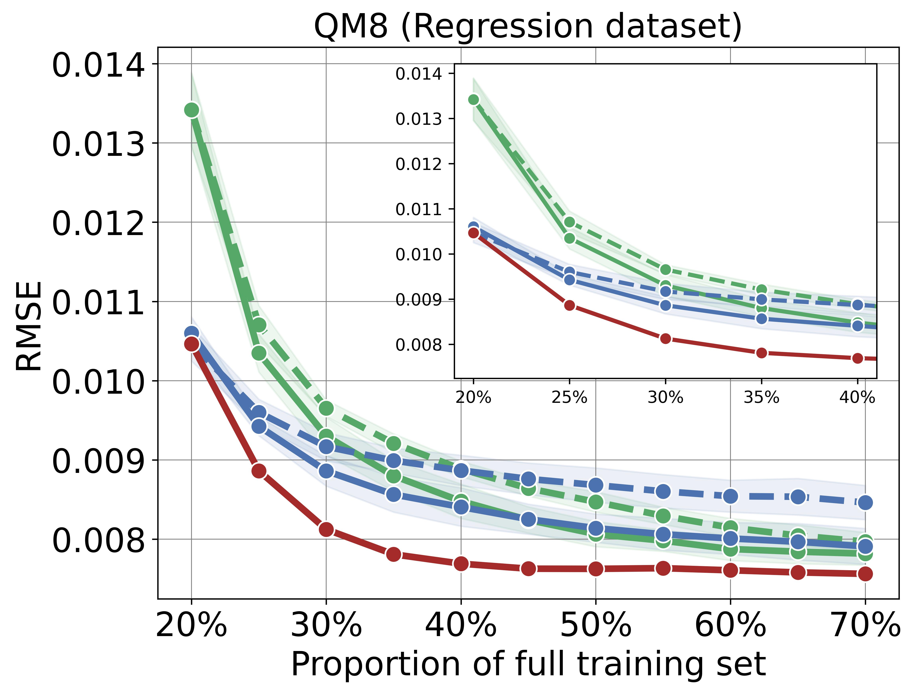 |
|-----------------------------------------------------------|

<b>Active learning performance deficiencies on small-scale datasets ESOL, FreeSolv, BACE, BBBP.</b>

| 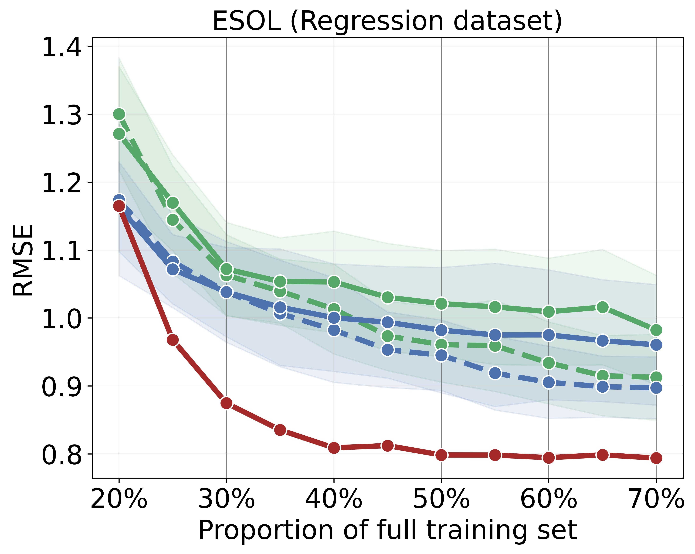 | 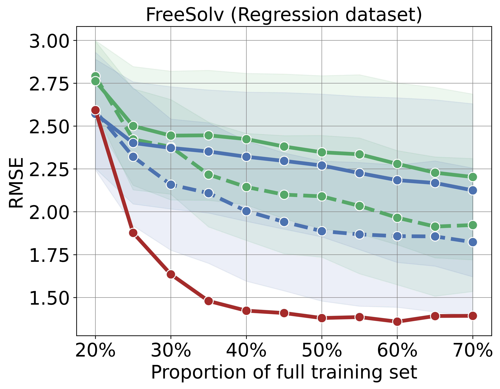 | 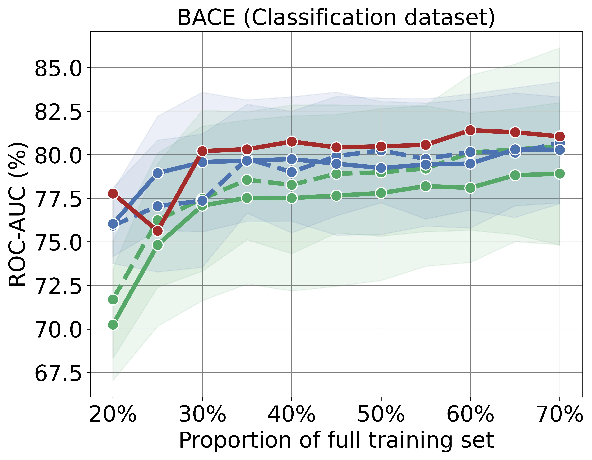 | 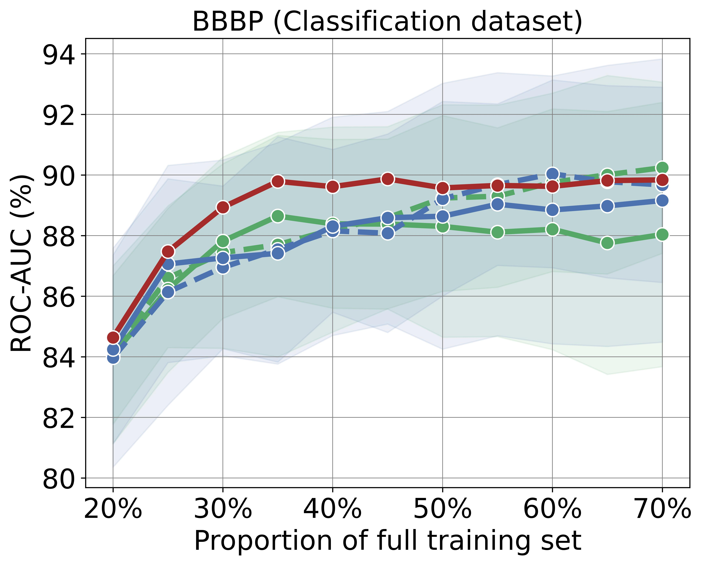 |
|---------------------------------------------------------------------|-----------------------------------------------------------|------------------------------------------------------------|-------------------------------------------------------------|

</details>

<hr style="border: 0.1px">


### Case study 5. Prior Prediction performance of contrastive prior

**⭐Predictive feature similarity**

**Step (1):** Predict Feature similarity using contrastive prior and uninformative prior, respectively.

```bash
python 5-1-prior_predict.py --data_name delaney --prior BayesMPP+Prior --predict_type similarity
```

```bash
python 5-1-prior_predict.py --data_name delaney --prior CPBayesMPP+Prior --predict_type similarity
```

**Step (2):** Visualize the feature similarity, the results will be saved in the
folder `/figures/Prior_prediction_similarity`.

```bash
python 5-2-visualize_prior.py --data_name delaney --prior BayesMPP+Prior --visualize_type similarity
```

```bash
python 5-2-visualize_prior.py --data_name delaney --prior CPBayesMPP+Prior --visualize_type similarity
```

<details>
  <summary><b>Click here for the results!</b></summary>

<b>Feature similarity between samples.</b>

| 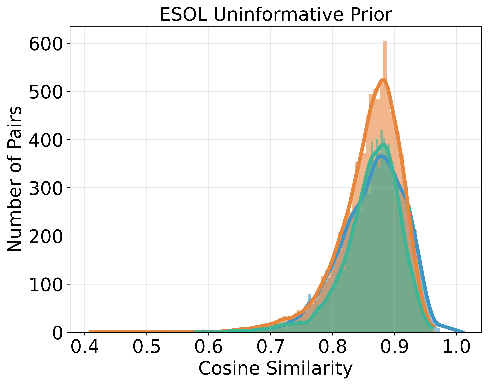 | 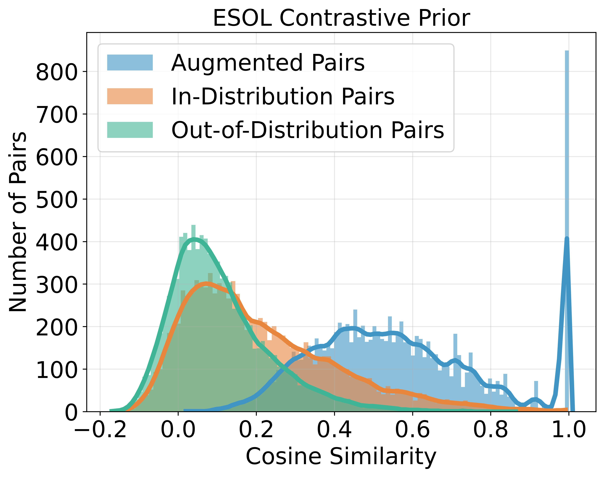 |
|------------------------------------------------|------------------------------------------------|

</details>

**⭐Predictive feature distinctiveness**

**Step (1):** Predict Feature distinctiveness using different priors.

```bash
python 5-1-prior_predict.py --data_name delaney --prior BayesMPP+Prior --predict_type latent
```

```bash
python 5-1-prior_predict.py --data_name delaney --prior CPBayesMPP+Prior --predict_type latent
```

**Step (2):** Visualize the feature distinctiveness, the results will be saved in the folder `/figures/Prior_prediction_distinctiveness`.

```bash
python 5-2-visualize_prior.py --data_name delaney --prior BayesMPP+Prior --visualize_type latent
```

```bash
python 5-2-visualize_prior.py --data_name delaney --prior CPBayesMPP+Prior --visualize_type latent
```

**Notes:** See more details in the Section "**Prior Prediction performance of contrastive prior**" in the paper.


<details>
  <summary><b>Click here for the results!</b></summary>

<b>Feature similarity between samples.</b>

| 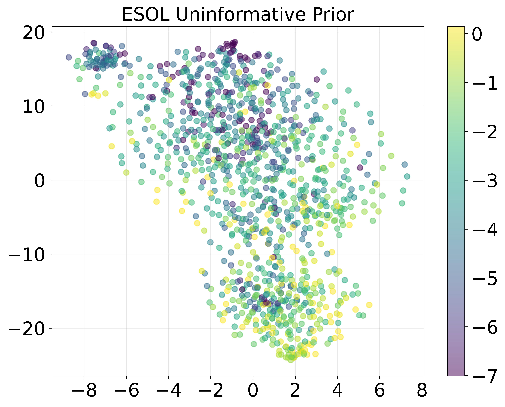 | 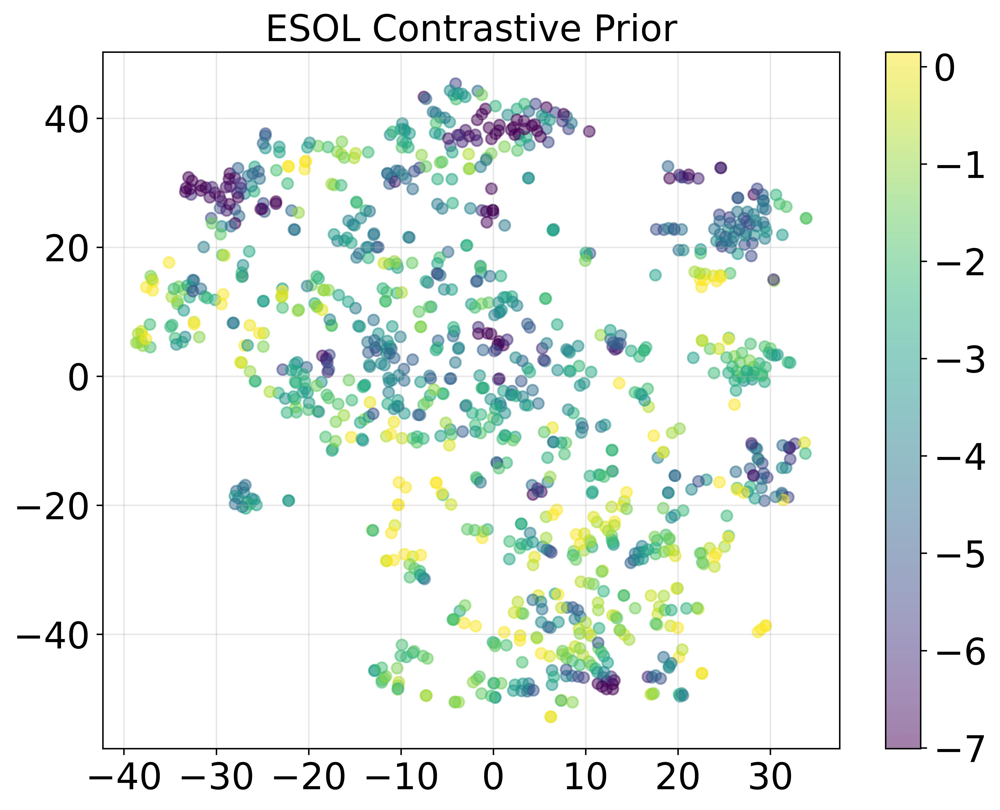 |
|--------------------------------------------|--------------------------------------------|

</details>

<hr style="border: 0.1px">

### Case study 6. Uncertainty quantification deficiency on classification dataset

In classification datasets, ECE is used to measure the model's ability to quantify _**aleatoric uncertainty**_. Specifically, in a binary classification task, the model's output can function as both a prediction probability and an indicator of uncertainty. For instance, for a given sample x, if its output is y = 0.95, we can confidently conclude it belongs to the positive class. In contrast, if the output is y = 0.55, our confidence in the prediction diminishes, as the sample may also belong to the negative class. ECE serves as an uncertainty metric to evaluate the correlation between uncertainty and predicted error.

For the specific calculation of this metric, please refer to Supplementary Section 3.2.

⭐ **Due to the randomness of the MC-Dropout neural network, the following experimental settings are implemented to ensure the stability of ECE calculations:**

- (1) The number of samples for the MC-Dropout model (Eqn. 18 in the manuscript) is set to `300`. 
- (2) The number of sub-intervals used for ECE calculation (Eqn. S8 in the Supplementary Information) is set to `K = 10`.

The prediction results for all models have been saved to the checkpoints. And for the multi-label datasets (Tox21, SIDER, ClinTox), the predicted values and uncertainties for all labels are saved separately. Please check the example at `results/CPBayesMPP/scaffold_split/tox21_checkpoints/seed_123/preds.csv`

In addition, the following command can be used to reapply the classification model to make predictions:

```bash
python 6-classification_predict.py --data_name bace --train_strategy CPBayesMPP --split_type scaffold --sampling_size 300
```
```bash
python 6-classification_predict.py --data_name bace --train_strategy BayesMPP --split_type scaffold --sampling_size 300
```

Then, the following command can be used to compare the ECE performance of the models under different training strategies. For single-label tasks (BACE, HIV, BBBP), the additional ECE calibration curves wiil be saved in `/figures/Uncertainty_calibration_curves_for_regression_datasets`.

```bash
python 2-visualize_uq.py --visualize_type ece --data_name bace --split_type scaffold
```

The results (See Supplementary Table S6) indicate that CPBayesMPP, based on contrastive priors, fails to provide better ECE performance in all classification tasks. We analyse this is primarily due to the **_inapplicability of the contrastive prior on classification datasets_**.

To verify this, please execute the script provided in "Case Study 5" and change the `--data_name` parameter to obtain results as reported in Supplementary Figs. 10 and 11.

**Note:** See more details in the Supplementary Section 3.2  **"Classification task UQ performance metrics"**.

<details>
  <summary><b>Click here for the results!</b></summary>

<b>Uncertainty quantification deficiency on classification dataset.</b>

|  |
|----------------------------------------------------------------|

</details>

<hr style="border: 0.1px">

## Enhance the task-specific posterior on customized dataset

**We recommend you to run the scripts above to reproduce our experiments before attempting to train the model using your
custom dataset to familiarize yourself with the pre-training and posterior inference processes of the CPBayesMPP.**

**Step (1): Prepare your pre-training dataset.**

Please refer to `pubchem-1m-clean.csv`
file <u>[here](https://drive.google.com/file/d/1FO_otxK3WHA629Xu1oseDWJPPJCUbgu5/view?usp=sharing)</u> to store your
unlabeled dataset in rows according to the following format:

|        pretraining_dataset.csv         |
|:--------------------------------------:|
|                 smiles                 |
| CN(c1ccccc1)c1ccccc1C(=O)NCC1(O)CCOCC1 |
|     Nc1ccc(NC(=O)CSc2cccc(F)c2)cc1     |
|   COCC(CNC(=O)c1ccc2c(c1)NC(=O)C2)OC   |
|      OCCn1cc(CNc2cccc3c2CCCC3)nn1      |
|    Nc1nc2ccc(F)c(F)c2n1Cc1ccccc1Br     |
|                  ...                   |

Then, run the script [dataset/prepare_pretrain_cache.py](dataset/prepare_pretrain_cache.py) to generate contrastive
tasks cache for accelerating the pre-training process.

**Step (2): Pre-training for contrastive prior.**

Run the script [0-pretrain.py](0-pretrain.py) to learn pre-train the model and replace the
parameter `--pretrain_data_name` with your own dataset name.

```bash
python 0-pretrain.py --batch_size 512 --epochs 50 --save_dir results/pretrain --pretrain_data_name your_pretrain_data_name --use_pretrain_data_cache
```

**Step (3): Prepare downstream datasets.**

Save your downstream datasets in folder `/dataset` by following format:

**regression_downstream_dataset.csv**

|         smiles         | label |
|:----------------------:|:-----:|
|    Clc1ccc2ccccc2c1    | -0.77 |
| Cc1occc1C(=O)Nc2ccccc2 | 5.14  |
|  CC(C)=CCCC(C)=CC(=O)  | -2.06 |
|          ...           |  ...  |

**classification_downstream_dataset.csv**

|             smiles              | label |
|:-------------------------------:|:-----:|
|  CCOc1ccc2nc(S(N)(=O)=O)sc2c1   |   0   |
|    CCN1C(=O)NC(c2ccccc2)C1=O    |   0   |
| CCCN(CC)C(CC)C(=O)Nc1c(C)cccc1C |   1   |
|               ...               |  ...  |

**Step (4): Infer task-specific posterior.**

Run the script [1-train.py](1-train.py) to infer the task-specific posterior and replace the parameter `--data_name`
with your own dataset name.

```bash
python 1-train.py --data_name your_dataneme --train_strategy CPBayesMPP --epoch 200 --split_type random --split_sizes 0.5 0.2 0.3
```

Check the file `results/CPBayesMPP/random_split/your_dataname_checkpoints/seed_123/preds.csv` and the result format will be as follows:

|      smiles      | preds | label | aleatoric uncertainty | epistemic uncertainty |
|:----------------:|:-----:|:-----:|:---------------------:|:---------------------:|
| COc2ncc1nccnc1n2 | -1.15 | -1.11 |         0.43          |         0.12          |
|   Brc1ccccc1Br   | -3.42 | -3.50 |         0.08          |         0.03          |
|    O=C1CCCCC1    | -0.53 | -0.6  |         0.10          |         0.06          |
|       ...        |  ...  |  ...  |          ...          |          ...          |

**Step (5):  Posterior Prediction with
Uncertainty Evaluation.**

Run the script [2-visualize_uq.py](2-visualize_uq.py) in Stage (c): case studies (1)~(5) and replace the parameter `--data_name`
with your own dataset name to make uncertainty predictions.

  ```bash
  python 2-visualize_uq.py --visualize_type auco --data_name your_dataname --split_type random --uncertainty_type aleatoric 
  ```

## Thanks

Thanks for the support of the following repositories:

|                        Source                        |                                   Detail                                    |
|:----------------------------------------------------:|:---------------------------------------------------------------------------:|
|         https://github.com/chemprop/chemprop         |              Implementation of message passing neural network               |
| https://github.com/gscalia/chemprop/tree/uncertainty |                  Implementation of concrete dropout layer                   |
|          https://github.com/yuyangw/MolCLR           | Implementation of augmentation strategies for contrastive molecules samples |
|      https://github.com/google-research/simclr       |                       Implementation of NT-Xent Loss                        |

## Cite us

If you find this work useful to you, please cite our paper:

```
@article{XXX,
  title={Contrastive Prior Enhances the Performance of Bayesian Neural Network-based Molecular Property Prediction},
  author={XXX},
  journal={XXX},
  year={2024}
}
```
